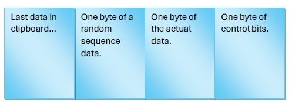
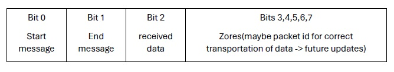

# Covert Channel Clipboard Message Exchange
This project demonstrates the implementation of a covert channel for exchanging messages between two processes using the system clipboard. It utilizes a specific encoding scheme to embed the desired message in the clipboard data.
## Solution Description
The main idea for solving this problem is to use the system clipboard as the platform for message transfer, along with a specific encoding for embedding the desired message in the clipboard. In this method, the sender reads the existing data from the clipboard, appends the desired data to it, and puts it back into the clipboard. The process of encoding and sending the message for transmission is as follows:
1. Fetch the clipboard data.
2. Append a single byte of data with a specific format.
3. Replace the last clipboard data with the encoded message and wait for the receiver to receive the data and inform you.
4. Repeat steps 1-3 until all bytes of data have been transmitted.



The encoding scheme involves converting ones (1s) to "\t" and zeros (0s) to the space character. This choice of characters minimizes visual impact if the message is accidentally pasted during the exchange.
In the following sections, we will discuss the usage of different parts of the data format shown in the image above.

The "Random sequence" section is added to distinguish the main clipboard data from the encoded data for the receiver. It should be noted that both parties are aware of this random sequence. The initial sequence in the code of both parties is hardcoded, but later it can be changed according to the defined instructions for the protocol for two reasons: first, to reduce the chance of accidentally encountering a random sequence at the end of the original clipboard data and confusing the receiver, and second, to make it harder for other factors to detect this type of message exchange (if the same random sequence is always used, it can be easily recognized).

The "Single byte of data" section includes one byte of the desired data to be sent in encoded form.

The "Control bits" section contains control bits that determine the status of the message for both the sender and the receiver. The control bits are as follows:



- The first bit indicates whether this message is the sender's first message or not. This bit is included so that the receiver knows the start of the communication.
- The second bit indicates whether this message is the final byte of data or not.
- The third bit indicates whether the receiver has received the message or not. The sender will know whether the receiver has received the message by reading the clipboard and checking this bit.
- The remaining bits currently do not have a specific purpose and are left for future updates.
## Receiver Algorithm

The algorithm for the receiver is written below:

1. Periodically read the last data in the clipboard and evaluate its last 24 characters. If the first 8 characters match the random sequence and the start flag is set to '1', then the transmission has started.
2. After each reading, set the received flag so that the sender knows you have received the packet.
3. Read until the last packet has been transmitted.
4. If the command was 'ceq:"an 8-bit number"', change the random sequence number according to the specified number in the command.

In this way, the sender can send a random sequence with the 'ceq' command.
## Explanation of sender.py
Here, you can see the main procedure of the sender:

```sender
random_sequence = '\t \t \t \t '  # -> 1 0 1 0 1 0 1 0
new_random_sequence = 0
previous_clipboard = ''
ceq_mode = False
while True:
    state = 'send'
    time_out_number = 0
    time_out_limit = 1000
    if ceq_mode:
        random_sequence = convert_num_code(new_random_sequence)
        ceq_mode = False
    m = input('Enter message: ')
    if m == 'ceq':  # in this protocol, you can change the random sequence number with this command (Change SEQuence).
        random_seq_gen()
        m = m + ':' + str(new_random_sequence)
        ceq_mode = True
    if len(m) == 0:
        continue
    time_out = False
    for i in range(len(m)):
        if time_out:
            break
        send_message(m, i)
        state = 'wait'
        time_out_number = 0
        while state == 'wait':
            curr_clip = pyperclip.paste()
            clipboard_enc = curr_clip[len(curr_clip) - 24:len(curr_clip)]
            if clipboard_enc[0:8] == random_sequence:
                if clipboard_enc[18] == '\t':
                    state = 'sending'
            sleep(0.001)
            
            time_out_number += 1
            if time_out_number == time_out_limit:
                print('time out reached, try to send the message again.')
                time_out = True
                break
    pyperclip.copy(previous_clipboard)
```
As you can see, there are some global variables(like random_sequence), and after that comes the main procedure.
First, it initializes the global variables(some of them are flags which indicate occurence of 'ceq' mode or time out), then it receives the message from the user, does some chekings on it and tries to send it character by character using the `send_message()` method.
After sending each byte of the message, it waits untill the receiver, receives the message and acknowledges the sender. Definitely, sender can't wait for ever, so there will be a time out threshold. if time_out occurs, the program will inform the user and asks for another message to send.
The `previous_clipboard` variable stores the last, clean data of system clipboard and it is updated and used inside `send_message()` method. Here, after the message transmition is completed, the original data of clipboard(which is stored in `previous_clipboard`) is again pushed in the clipboard just to leave no trace of message transmission.
```send_message()
def send_message(message: str, index: int):
    control_char = 8 * ' '
    global random_sequence
    global previous_clipboard
    enc_m = random_sequence
    enc_m = enc_m + convert_num_code(ord(message[index]))
    if i == 0:  # this is the first message so the 'start' flag should be 1.
        control_char = '\t' + 7 * ' '
    if i == len(message) - 1:  # this is the last message so the 'end' flag should be set.
        control_char = ' ' + '\t' + 6 * ' '
    enc_m = enc_m + control_char
    current_clipboard = pyperclip.paste()
    if current_clipboard[:len(current_clipboard) - 24] == previous_clipboard:
        new_clipboard = previous_clipboard + enc_m
    else:
        new_clipboard = current_clipboard + enc_m
        previous_clipboard = current_clipboard
    pyperclip.copy(new_clipboard)
```
You can see how the `previous_clipboard` is used here. And how the packet is prepared to be sent. this method uses `convert_num_code()` method to convert(code) numbers of ascii codes to bunch of spaces and tabs.
```convert_num_code()
def convert_num_code(number):
    result = ''
    digits = 8
    digits -= 1
    while digits >= 0:
        if (number >> digits) % 2 == 0:
            result += ' '
        else:
            result += '\t'
        digits -= 1

    return result
```
And here, is the method used for generating new random sequences:
```random_seq_gen()
def random_seq_gen():
    global new_random_sequence
    random_seq = random.randint(0, 256)
    new_random_sequence = random_seq
```

## Explanation of receiver.py
The receiver's responsibility is not as hard as the sender. It just reads the clipboard and waits for data from sender, once it detected the first message, it continues the receving process until the last byte has been received.
It should mark messages as received(third bit of control bits) after getting the sender's data.
It should check the received message and if the message indicated a change in the sequence number(`ceq:number`), the sequence number should also be updated.

```receiver
while True:
    buffer = ''
    state = 'pending'
    print('waiting for message')
    while True:
        curr_clip = pyperclip.paste()
        if len(curr_clip) < 24:
            continue
        curr_len = len(curr_clip)
        enc_m = curr_clip[curr_len - 24: curr_len]
        if enc_m[0:8] == random_sequence:
            if enc_m[18] == '\t': # the sender is not aware of receiver's receive still.
                sleep(0.001)
                continue
            if enc_m[16] == '\t' and state == 'pending':  # it's a starting message.
                buffer += chr(convert_code_num(enc_m[8:16]))
                enc_m = enc_m[:18] + '\t' + enc_m[19:]

                pyperclip.copy(curr_clip[:curr_len-24] + enc_m)
                if enc_m[17] == '\t':
                    print(f'read a message: {buffer}')
                    break
                state = 'start'
                #print(buffer)
                continue
            elif enc_m[16] == ' ' and enc_m[17] == ' ' and state == 'start':  # it's still transmitting.
                buffer += chr(convert_code_num(enc_m[8:16]))
                enc_m = enc_m[:18] + '\t' + enc_m[19:]

                pyperclip.copy(curr_clip[:curr_len-24] + enc_m)
                #print(buffer)
                continue
            elif enc_m[17] == '\t':  # this is the last packet.
                buffer += chr(convert_code_num(enc_m[8:16]))
                enc_m = enc_m[:18] + '\t' + enc_m[19:]

                pyperclip.copy(curr_clip[:curr_len-24] + enc_m)
                state = 'pending'
                #print(buffer)
                print(f'read a message: {buffer}')
                if buffer.startswith('ceq'):  # time to change the random sequence.
                    buffer = int(buffer.split(':')[1])
                    random_sequence = convert_num_code(buffer)
                break

        sleep(0.001)
```
The receiver aslo should know how to interpret spaces and tabs:
```convert_code_num()
def convert_code_num(code: str):
    num = 0
    for index in range(0, 8):
        if code[index] == '\t':
            num += 2 ** (7-index)
    return num
```
## An example
Here you can see an example of sending and receiving messages:

## Transfare rate
Since the sender waits 1 miliseconds after each sending each packet, the transfare rate will be 1KB/SEC in the best case. other factors like time outs, programing langauge used to implement this protocol, user interacting with clipboard(for example copying and pasteing stuff) etc... will reduce the rate by which the data is transfared.

## Requirments
```
pip install pyperclip
```
